<!-- 头图：纯文字 logo（亮/暗自动切换） -->

  <picture>
    <source media="(prefers-color-scheme: dark)" srcset="assets/header-dark.svg">
    
  </picture>

<!-- 一句英文随想 -->

  <i>"Enjoy programming and build awesome stuff."</i>

<!-- r34 计数器 -->

  

<!-- GitHub Stats 卡片（自动生成） -->

  <picture>
    <source media="(prefers-color-scheme: dark)" srcset="profile/stats-dark.svg">
    
  </picture>

<!-- 贡献贪吃蛇（亮/暗自动切换） -->

  <picture>
    <source media="(prefers-color-scheme: dark)" srcset="https://cdn.jsdelivr.net/gh/LanluZ/LanluZ@output/github-contribution-grid-snake-dark.svg">
    
  </picture>

<!-- 签名 -->

  <b>🍥 &nbsp;thanks for visiting&nbsp; 🍥</b>

